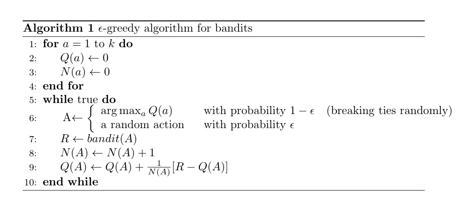

# **Multi**-armed bandits

## RL book (Chapter 2)

RL introduces **evaluative feedback** (was the actual action taken good?) by opposition of supervised learning **instructive feedback** (what would the best action be, regardless of the action taken?).

### k-armed Bandit Problem definition

- k possible actions at any time step
- each action leads to a numerical rewards drawn for a (unknown) stationary probability distribution

Before we define a strategy we define the **value of an action**, a.k.a the expected reward $q_\star(a)=\mathbb{E}[R_t|A_t=a]$.

An RL algorithm for the multi-armed bandit problem has 3 components:

1. *Values estimation*: In practice we don't know the values but we estimate them with **action-value methods**: the simplest one is to estimate the expected reward with the average one: $Q_t(a) \dot = \frac{\sum_{i=1}^{t-1}R_i 1_{A_i=a}}{\sum_{i=1}^{t-1}1_{A_i=a}}$
2. *Strategy*: knowing the values estimates, how to choose the next action? This step balances between *exploration* (trying to refine values estimates) and *exploitation* (maximizing the short-term reward by using an optimal strategy). 
   1. The most naive strategy follows *greedy actions*: at each time step we choose the action with the maximum value: $A_{t} \doteq \arg \max _{a} Q_{t}(a)$. 
   2. A slightly less aggressive strategy called *$\epsilon$-greedy*  consists in choosing the optimal action $1-\epsilon$ of the time and choosing a random one $\epsilon$ of the time. The larger $\epsilon$ the more exploration.
3. *Values initialization*: we have to set the initial values for all actions. For the multi-armed bandit problem it is natural to set them all to 0.

### Incremental implementation

The value of an action $a$ can be written as a function of the immediate rewards that followed this action each time it was selected, e.g. if the action $a$ has been selected $n$ times before then the corresponding value is 

$$Q_{n+1} \doteq \frac1n \sum_{i=1}^n R_i=\frac1n\left(R_n + (n-1)Q_n \right)=Q_n+\frac1n \left[ R_n-Q_n\right]$$, 

where $R_n-Q_n$ is the **error** of the current estimate, and $\frac1n$ is the **step size**. 

Here $Q$ is interpreted as a refined estimate for the actions values.

### Non-stationary problems

In practice **most reinforcement learning problems are non-stationary**: the action-value distribution changes over time. To take it into account we can weight recent rewards more in values: 

- popular strategy = constant weight values updates: $Q_{n+1} \doteq Q_n+\alpha \left[ R_n-Q_n\right]$, where $\alpha \in (0,1]$, also called *exponential recency-weighted average* because the weight of a previous value estimate $Q_i$ has a weight $(1-\alpha)^{n-i}$ for $Q_n$.  
- general weight $\alpha_n(a)$: convergence to the real value is guaranteed (result from stochastic approximation theory) iif $\sum_{n=1}^\infty \alpha_n(a) = \infty$ (i.e. steps are large enough to overcome fluctuations) and $\sum_{n=1}^\infty \alpha^2_n(a) < \infty$ (steps eventually become small enough to converge).

### Optimistic initial values

Using initial estimates that correspond to large rewards leads to more exploration: an action estimate is initially considered better due to a more favorable average.

Useful heuristic but:

- only useful to drive early exploration
- not well suited for non-stationary problems
- have to find out what values are optimistic in the first place

### Upper-Confidence Bound (UCB) Action Selection

A.k.a. Optimism in the Face of Uncertainty: Take into account the average value of a value estimate **and** the uncertainty with $A_t\doteq \arg_a \max\left[Q_t(a)+c\sqrt{\frac{\ln t}{N_t(a)}}\right]$, where $c$ is a hyper-parameter.

### Contextual Bandits (+ John Langford interview)

First application of contextual bandits: 2010 Yahoo News. Nowadays: [Azure Perzonalizer Service](https://azure.microsoft.com/en-us/services/cognitive-services/personalizer/).
