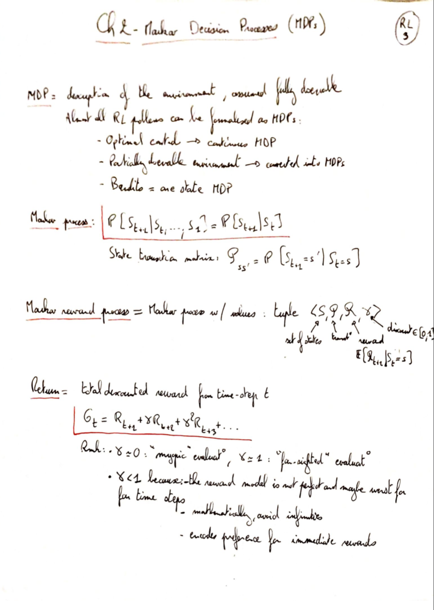

## On the reward hypothesis

### Fishing analogy of RL

- Give man a fish: traditional programming
- Teach a man how to fish: supervised learning
- Give man a taste of fish and let him figure out how to get it: reinforcement learning

Ways to design the reward function:

Tricky example = thermostat: what is the "common currency" between the cost of heating and the benefit of being warm? How to balance them

Solutions:

1. Programming:
   1. Hard-coded (e.g. 1 for goal success and 0 otherwise → problem of long-term rewards → have to hand-craft intermediate goals rewards)
   2. With a human-in-the-loop
2. Through examples
   1. Mimic rewards
   2. inverse reinforcement learning: mimic behavior and learn reward function
3. Optimization
   1. Evolutionary optimization: start a bunch of agents with a long term goal and figure out reward from the winners

## Episodic vs continuous tasks

No need for discount with episodic tasks.

Examples:

- Episodic: chess games
- Continuous: thermostat behavior.

