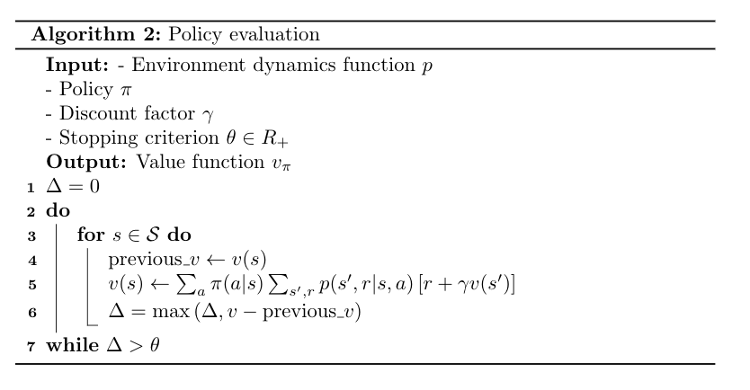

# Policy evaluation

Assume the environment dynamics $p$ is known. Policy evaluation allows to evaluate the value function of a policy $\pi$ Using the Bellman equation as an update rule:

$v_{k+1}(s) = \mathbb E_{p, \pi} \left[R_{t+1} + \gamma v_k(S_{t+1}) | S_t = s \right]$.

$v_k$ is guaranteed to converge to the real $v_\pi$ values by the **policy evaluation theorem** (see book for the proof).

