# Policy evaluation & improvement

## Policy evaluation (Prediction)

Assume the environment dynamics $p$ is known. Policy evaluation allows to evaluate the value function of a policy $\pi$ Using the Bellman equation as an update rule:

$v_{k+1}(s) = \mathbb E_{p, \pi} \left[R_{t+1} + \gamma v_k(S_{t+1}) | S_t = s \right]$.

$v_k$ is guaranteed to converge to the real $v_\pi$ values by the **policy evaluation theorem** (see book for the proof).

## Policy improvement (Control)

Policy improvement theorem: $\left\{q_\pi(s, \pi'(s)) > q_\pi(s, \pi(s)),\; \forall s \in \mathcal S\right\} \Longrightarrow \pi'>\pi$

Thus we can greedily improve the policy: $\pi'(s) = \arg \max_a \sum_{s', r} p(s', r|s, a)\left[r+\gamma v_\pi(s')\right]$

We can combine policy evaluation and improvement to 

```mermaid
stateDiagram
	[*] --> Optimization: Initial policy π
	state Optimization {
  	Policy --> Value: Evaluation
		Value --> Policy: Improvement
  }

	Optimization --> [*]: Optimal policy π ≃ π*
```

### Stay warm example

The goal is to find the warm place. The hills are cold, the plains is freezing, and the cave is warm, but the agent cannot go from the hills to the cave directly; also, the agent cannot stay in the hills because it is dangerous.

In the following we represent the states like so ( hills, plain, cave). In this example, the optimal policy is to try to reach the cave wherever you are, or stay there if you are already there, the representation of the optimal policy is the following: $(\rightarrow, \rightarrow, \rightarrow)$

We start with a random policy, and initial values of 0 for all states, and a discount factor of 1/2. 

1. Policy evaluation: $v_0=( -1, +1/2, -1/2 )$, iteration: $\pi_1(\rightarrow, \rightarrow, \leftarrow)$  
2. Policy evaluation: $v_1=(-2, +1, -2)+\frac12(+1/2, -1/2, +1/2)=(-2.25, 1.5, -1.5)$  , iteration: $\pi_2=(\rightarrow, \rightarrow, \leftarrow)$  
3. ...
4. Policy evaluation: $(a, b, c)$ with $c>b>a$  , iteration: $(\rightarrow, \rightarrow, \rightarrow)$  

### Generalized policy iteration

Idea: it is not necessary to complete the evaluation step before proceeding to the iteration one, and *vice versa*, the interplay between evaluation and iteration can be more rapid.

### Value iteration

One sweep of policy evaluation over all the states is followed by a greedy policy iteration step.

### Synchronous vs Asynchronous Dynamic Programming

### Alertnatives to Dynamic Programming for policy improvement

#### Monte-Carlo sampling

Evaluation $v(s)$ by averaging states returns $G$ reached after following the policy $\pi$ from state $s$.  

🚨Pb: might be slow to converge as there are many returns to average due to the stochasticity of $\pi$ and the environment $p$.

#### Brute-force search

Requires $|\mathcal{A}|^{|\mathcal S|}$ operations, i.e. it is exponential in the number of states → prohibitive (curse of dimensionality).

 