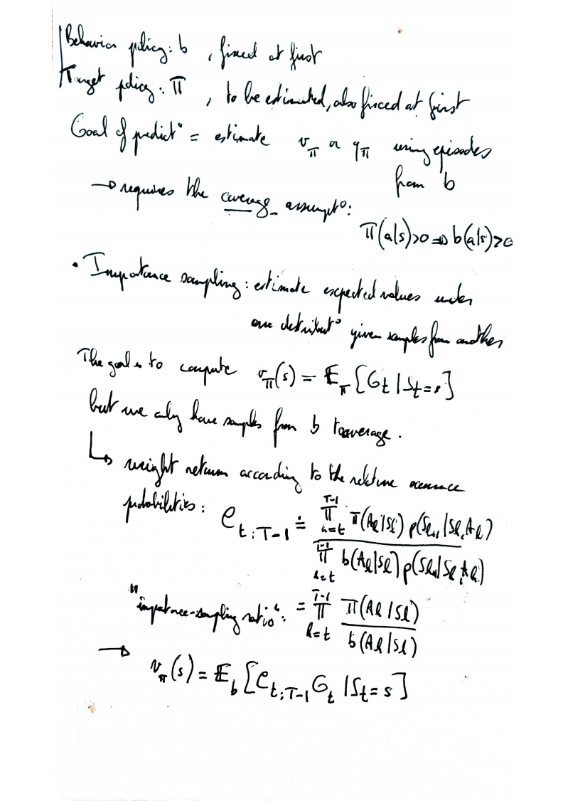
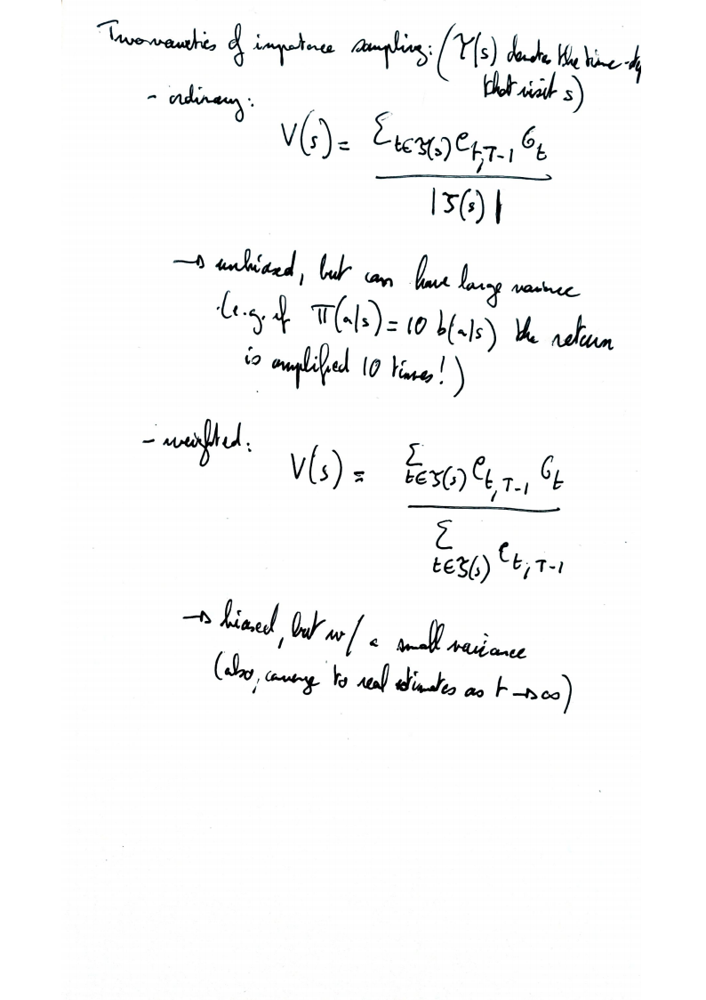

# Monte-Carlo Methods

Idea of Monte-Carlo for RL: repeated random sampling, then average sample returns. 

- No need for prior knowledge of the environment's dynamics! 
- Conversely to Dynamic Programming methods, does not **bootstrap** (i.e. updates are performed independently for different samples)
- Similarity with bandits: estimation of average reward (multi-arm bandits)→ estimation of average return (Monte-Carlo)

## Monte Carlo for control

### The problem of action-values estimation

So far we've estimated state values $v(s)$, but to improve a policy without a model of the environment we need to estimate action-values $q(s, a)$. The problem is that some actions are never used by the optimal policy and we need a way to nudge exploration. 

We can do it with:

- exploring start
- $\epsilon$-soft policies (a generalization of $\epsilon$-greedy policies)
- off-policy learning

### Exploring start

Same algorithm as the MC policy evaluation, but with exploring start and assignement of policy actions.

### $\epsilon$-soft policies

Same exploration technique as $\epsilon$-greedy policy, but the probability of suboptimal actions can be larger than $\frac{\epsilon}{|A|}$.

The resulting control algorithm is the same as before with the changes highlighted in green:

### Off-policy learning

We split the exploration and exploitation into two policis: the behavioral policy $b$  and the target policy $\pi$. The target policy is learned while the behavioral policy $b$ is used to estimate the value of the target policy.

To obtain estimates of the action-values under the target policy, the behavioral policy $b$ must **cover** the target policy $\pi$: $\pi(a|s) > 0 \Rightarrow b(a|s) > 0$.

#### Importance sampling

Importance sampling is used to estimate expected values under a distribution (here the target policy $\pi$) given samples from another distribution (here the behavioral policy $b$). To do so, we compute the relative occurence probabilities ratio of a sequence of actions and states $(S_t, A_t), \dots,(S_{T-1}, A_{T-1})$: 

$\rho_{t,T-1}=\frac{\prod_{k=t}^{T-1}\pi(A_k|S_k)p(S_{k+1}|S_k, A_k)}{\prod_{k=t}^{T-1}b(A_k|S_k)p(S_{k+1}|S_k, A_k)} = \prod_{k=t}^{T-1}\frac{\pi(A_k|S_k)}{b(A_k|S_k)}$ 

Such that $v_\pi(s) = \mathbb E_\pi \left[ G_t |S_t=s\right] = \mathbb E_b \left[ \rho_{t,T-1}G_t |S_t=s\right] $

Using the relative occurence probabilities ratio $\rho$, we can thus estimate the value of a state $s$ that is visited during (possibly several) time steps $\tau(s)$:

$V(s)=\frac{\sum_{t \in \tau(s)} \rho_{1, T-1} G_{t}}{|\tau(s)|}$

This "ordinary" implementation of importance sampling is unbiased but can have a large variance (e.g. if $\pi(s) = 10 b(s)$ for a given state, the return is amplified 10 times for this state). Because of this, we often use the "weighted" version of importance sampling:

$V(s)=\frac{\sum_{t \in \tau(s)} \rho_{t, T-1} G_{t}}{\sum_{t \in \tau(s)} \rho_{t, T-1}}$

It is biased but has a smaller variance than the ordinary version.

We can use importance sampling to generate episodes according to the behavioral policy $b$, and update the target policy $\pi$ accordingly → off-policy learning. Here is the example for prediction only, the generalization to control can be found section 5.7 of [the RL book](http://www.incompleteideas.net/book/RLbook2020.pdf).

## Written notes

