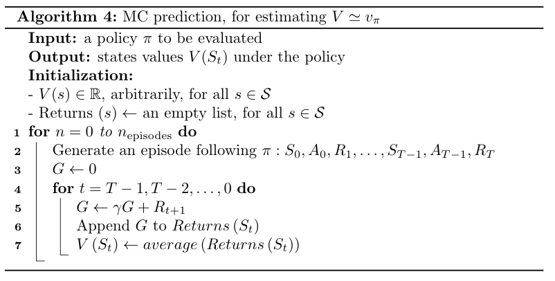
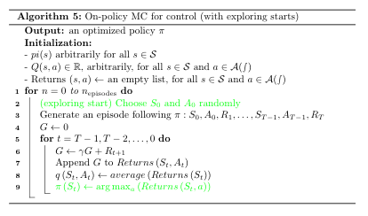
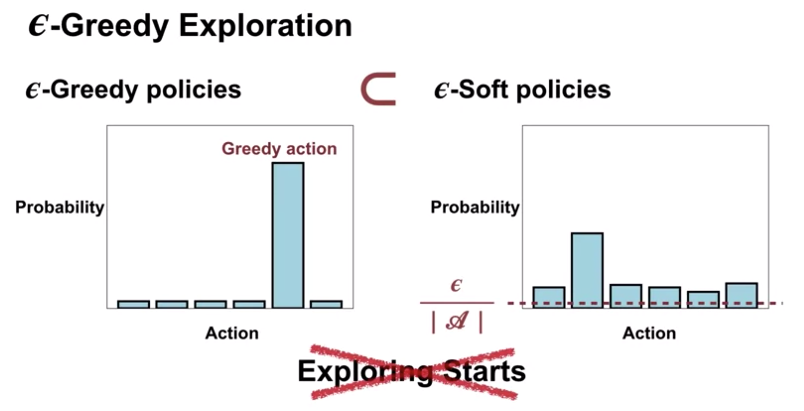
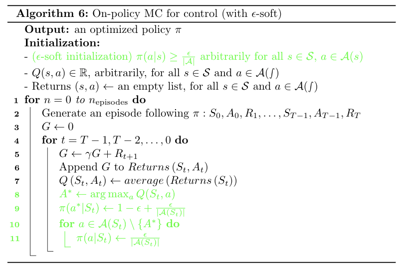
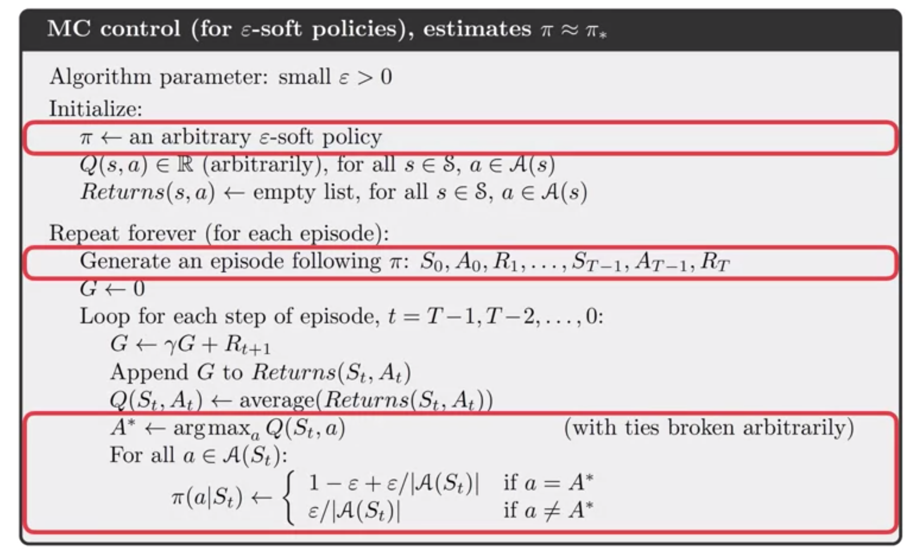
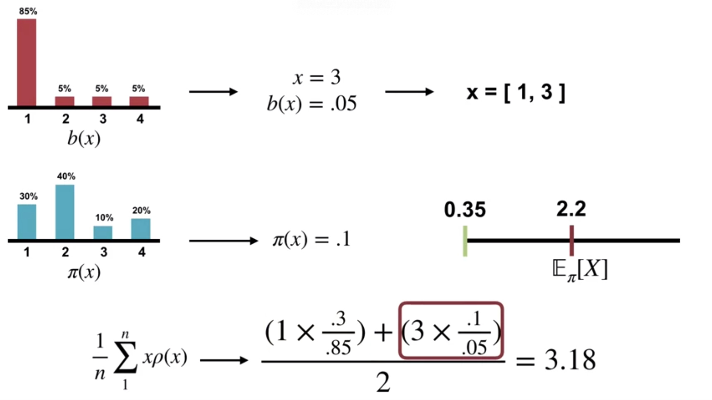

# Monte-Carlo Methods

Monte-Carlo = repeated random sampling

No need for prior knowledge of the environment's dynamics!

Similarity with bandits: estimation of average reward (multi-arm bandits)→ estimation of average return (Monte-Carlo)

## Monte Carlo for control

### Exploring start

Same algorithm as before, but with exploring start and assignement of policy actions.

### $\epsilon$-soft policies

Algorithm is the same as before with the following changes

## Off-policy learning

The behavioral policy $b$ must **cover** the target policy $\pi$.

### Importance sampling

