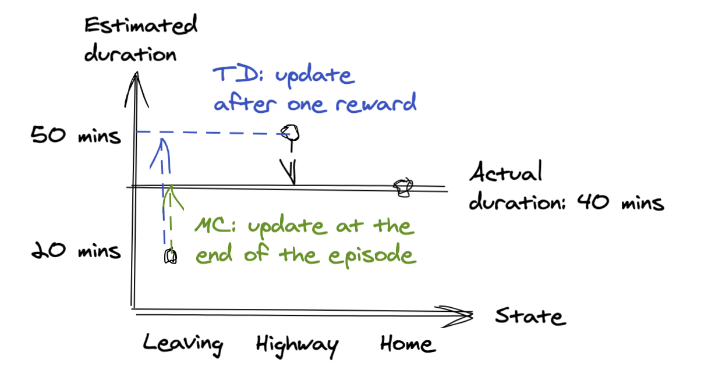
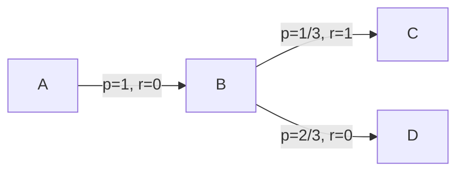

# Temporal Difference Learning

Temporal Difference (TD) learning combines the bootstraping (action and state values updates take into acount other actions and states updates) idea of Dynamic Programming, and the model-free approach of Monte-Carlo.

## TD prediction

With Monte-Carlo estimation, the states values are updated only at the end of an episode:  $V(S_t) \leftarrow V(S_t) + \alpha \left[ G_t - V(S_t)\right]$.

With TD, values are updated after every time step $V(S_t) \leftarrow V(S_t) + \alpha \,\delta_t$ where $\delta_t=R_{t+1} + \gamma\left[V(S_{t+1}) - V(S_t)\right]$ is the "TD(0) update", a.k.a. "one-step TD update". 

## Driving home example

I drive home everyday and try to predict the duration of the trip. With MC, I only update my estimates after I've completed a trip. With TD, I update states values immediately when I observe the next one. Thus, if I have good estimates for following steps I can leverage them. E.g., if I had a stop at the grocery shop before taking the highway, I can leverage my accurate estimate for the highway to improve my estimate of the trip duration from the grocery store, without waiting until I gather many examples of trips from the grocery store.

## Random walk example

Consider the example of a 1D random walk with a 50 % chance of going left and 50 % chance of going right. The rightmost state ends an episode with a reward of 1, while the leftmost state ends the episode. Here there is no policy we are simply estimating states values. After a first episode that ends in the right, rewarded terminal state, MC and TD lead to the following state values estimates:

## Batch processing

TD updates can be applied by batches: accumulate information about other states updates before performing an update. The benefits can be seen with the following MRP example, for which we've observed 3 episodes: (A,0, B, 0), (B, 1), (B,  0)

With batch processing, the TD estimate for state A is 1/3 . Without batch processing it would 0. It would also be 0 with MC, simply because there's no example of sequence (A, 0, B, 1) in our sampled episodes.

## Written notes

