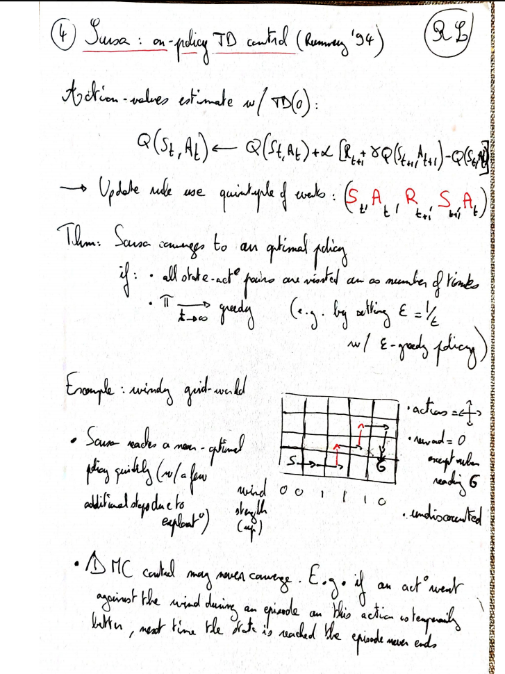
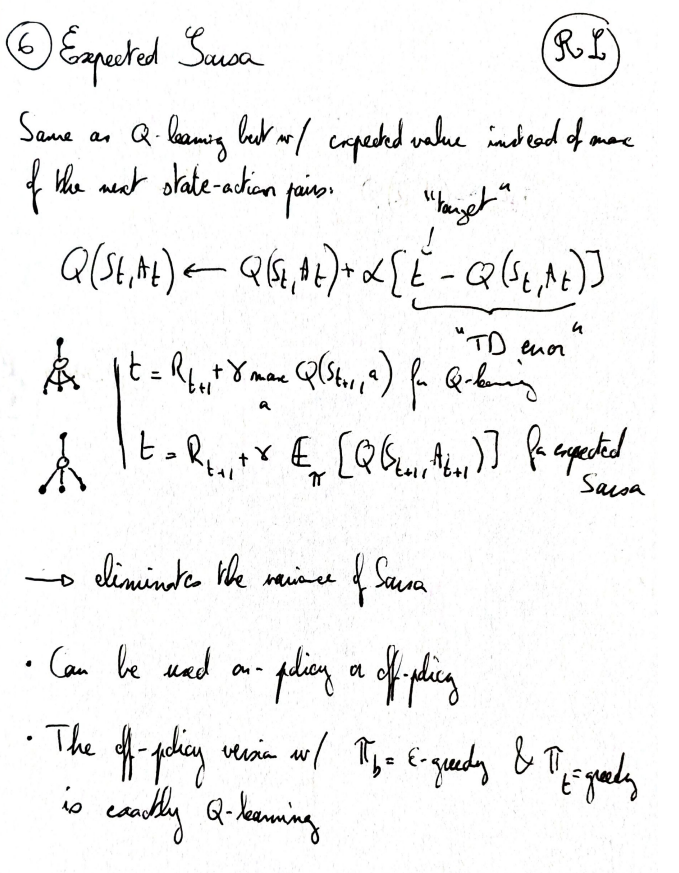
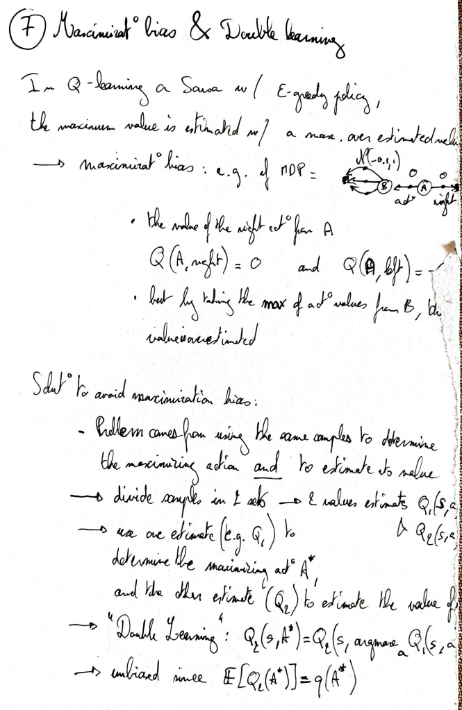
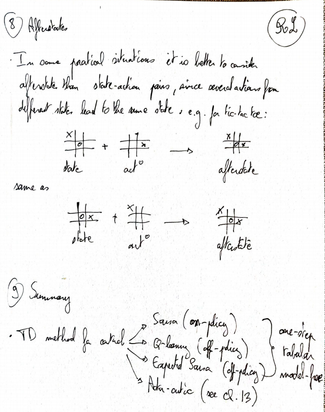

# Temporal difference for control

## Sarsa

Sample-based version of policy iteration. The name comes from the data used to perform updates: $(\textcolor{green}{S}_t, \textcolor{green}{A}_t, \textcolor{green}{R}_{t+1}, \textcolor{green}{S}_{t+1}, \textcolor{green}{A}_{t+1})$

Where the TD target is $\mathrm{Target}=R_{t+1}+\gamma Q(S_{t+1}, A_{t+1})$. 

## Q-learning

Sample-based version of value iteration. Very similary to *Sarsa*, but uses a different TD-target: $\mathrm{Target}=R_{t+1}+\gamma \max_a Q(S_{t+1}, a)$. 

While Sarsa uses a sample-based update based on the standard Bellman equation, Q-learning uses a sample-based update based on the Bellman **optimality** equations.

## Expected Sarsa

Idea of Expected Sarsa = Same algorithm as Sarsa, but compute the expected next action value instead of a sample estimate.

$\mathrm{Target}_{\mathrm{Sarsa}} = R_{t+1} + \gamma Q(S_{t+1}, A_{t+1}) \longrightarrow \mathrm{Target}_{\text{Expected Sarsa}} = R_{t+1} + \gamma \sum_{a} \pi(a|S_{t+1}) Q(S_{t+1}, a)$

Notes:

- Lower variance, at the cost of a more complex computation
- Expected Sarsa generalizes Q-learning and Sarsa: the target policy $\pi$ defined in the TD target can be different from the behavior policy used to take the action $A$. If the target policy $\pi$ is greedy w.r.t. the action value estimate $Q$ , then $\sum_{a} \pi(a|S_{t+1}) Q(S_{t+1}, a) = \max_a Q(S_{t+1}, a)$, i.e. this is the Q-learning algorithm.

## Temporal difference methods summary 

## Written notes

