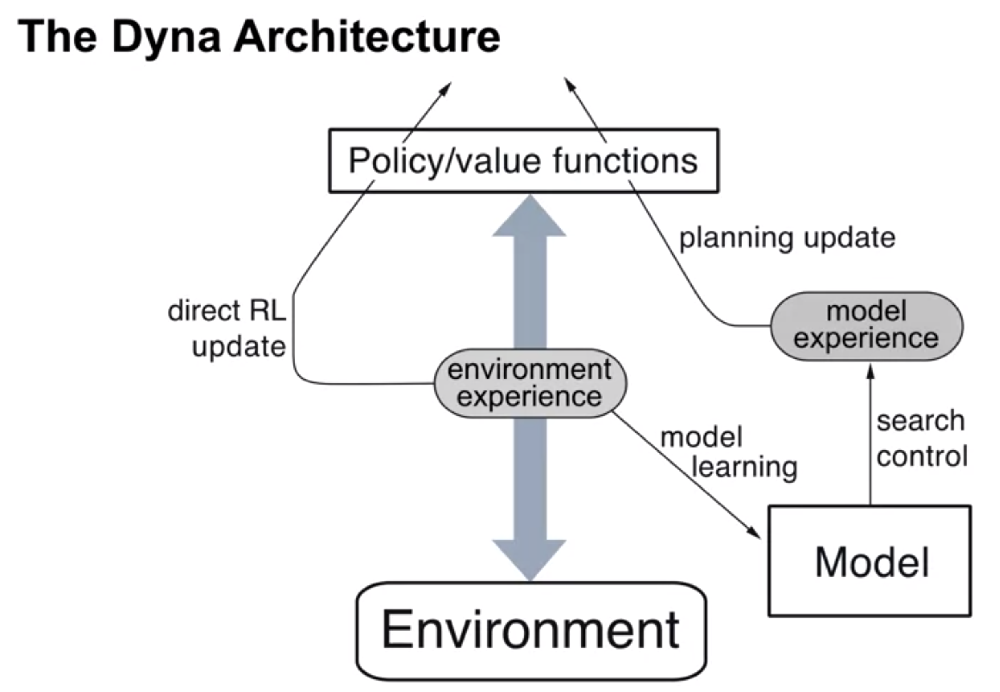
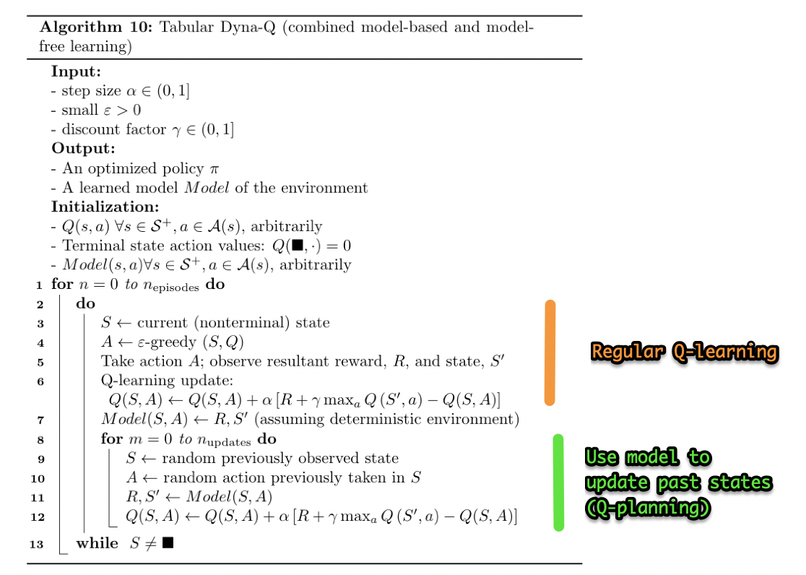

# Planning, learning, & acting

Environment model = given state and action, outputs the proba of a pair of reward and next state

Planning: use environment model, to learned from "simulated" experience instead of direct interaction with the environment

Sampling model (requires less memory) vs distribution model (can be used to compute exact expected outcome)

Random tabular Q-planning: use sampling from environment model instead of acting in a real environment

## Dyna-Q algorithm: combine Q-learning (model-free) and Q-planning (model-based)

Dyna: combine "direct" RL and planning. The environment is used to perform RL updates **and** to improve the environment model.

## Problem of model inaccuracy

Two sources of inaccuracy:

- Incomplete model (some state-action pairs haven't been observed yet)
- The environment changes (the model is outdated)

→ Exploration/exploitation tradeoff: one solution = Dyna-Q+: artificially increased reward for transitions that haven't been updated in a while ($r \rightarrow r + \kappa \sqrt\tau$  where $\tau$ is the number of time steps since the transition was last tried)