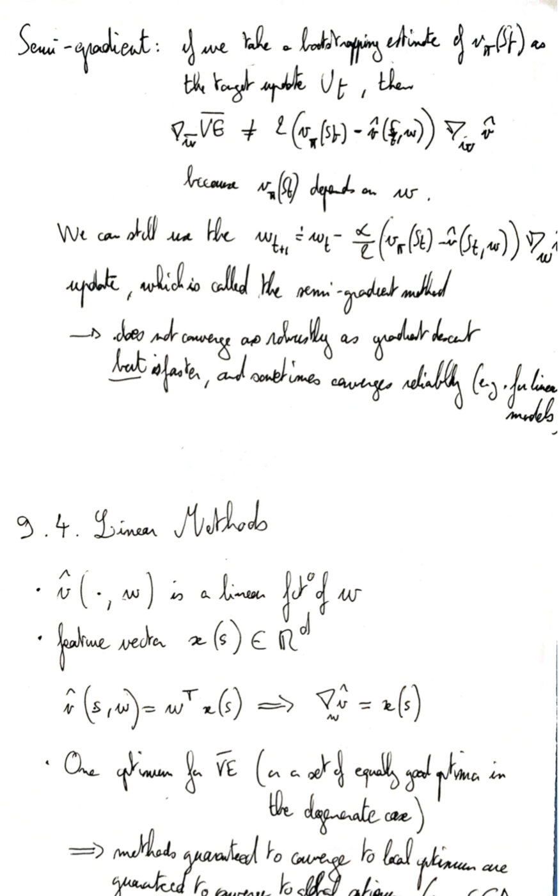

# Parametrized Functions

Example of intractable case for tabular methods: images (would have to keep track of a state for every possible image).

### Example: positions on a grid

Values can be stored in a table $v(s) = v(X(s), Y(s))$ → 15 states

**or** we can represented values via a parametrized function, e.g. $\hat v (s, w) = w_1 X + x_2 Y$ → 2 parameters

Note: the tabular representation is a special case of linear parametrized function where 

$$x_i = \mathbb{I}_i \quad \text{and} \quad \hat{v}(s, w)=w^T x(s)=w_i=v(s)$$ 

## Value estimation as a supervised learning problem

Dataset: $\left\{ (S_1, G_1), (S_2, G_2), \dots\right\}$ (MC) or $\left\{ (S_1, R_2+\gamma \hat v (S_2, w)), (S_2, R_3+\gamma \hat v (S_3, w)), \dots\right\}$  (TD).

This is a specific case of supervised learning as 

- the value function approximator should support online learning
- (For TD) The target depends on the agent estimate

Objective: Mean Squared Value Error:

 $$\overline{V E}=\sum_{s} \mu(s)\left[v_{\pi}(s)-\hat{v}(s, \mathbf{w})\right]^{2}$$

where $\mu$ is the states weight (typically dependent on the state's visit frequency).

Learning: with gradient descent (guaranteed to converge to global minimum for linear model and mean squared value error, under stochasticity assumptions):

$$ w_{t+1} \doteq w_t -\alpha \nabla_w J$$

Note: A global minimum of the error function may not correspond to the true value function $v_\pi$ because $\hat v$ is limited by the choice of  $x$. E.g. if $\mathbf x (s) = 1 \quad \forall s\in \mathcal S $, then for the linear model $ \nabla_w \overline{V E} = 2 \sum_s \mu(s)\left[ v_\pi(s) -w\right] \Longrightarrow \hat v(s) \rightarrow \sum_s v_\pi(s)$

### State aggregation 

Idea: update value for groups of states → specific case of linear approximation with $x(s) = (\mathbb I_{g_1}, \mathbb I_{g_2}, \dots)$ where $g_1$ is the first states group, $g_2$ the second one, etc.

### Semi-Gradient TD for Policy Evaluation

Gradient update for Mean-Square Value Error: 

$$\mathbf{w} \leftarrow \mathbf{w}+\alpha\left[U_{t}-\hat{v}\left(S_{r}, \mathbf{w}\right)\right] \nabla \hat{v}\left(S_{r}, \mathbf{w}\right)$$ 

if the target update $U_t$ does not depend on $\mathbf w$ (valid, e.g. for MC estimates of returns $U_t = G_t$).

If $U_t$ depends on $\mathbf w$ (e.g. for TD updates $U_t = R_{t+1} + \gamma \hat v(S_{t+1}, \mathbf w)$), we can also use the gradient update formula above, but the method is called semi-gradient.

If $U_t$ is an unbiased estimator of $G_t$ then $\mathbf w$ converges to a local optimum, but for the TD target (for which $U_t$ is biased) the updates variance is lower than for the MC target, and also TD learns faster because it learns during episodes.

## Linear TD

For linear TD the semi-gradient update reads: $\mathbf{w}_{t+1} \doteq \mathbf{w}_{t}+\alpha\left[R_{t+1}+\gamma \hat{v}\left(S_{t+1}, \mathbf{w}_{t}\right)-\hat{v}\left(S_{t}, \mathbf{w}_{t}\right)\right] \mathbf{x}_{t}$

Linear TD with Semi-gradient does not converge to a local minimum, but to the TD fixed point that minimizes the "Projected Bellman Error": $$(b-Aw)^T (b-Aw)$$ where $\mathbf{b} \doteq \mathbb{E}\left[R_{t+1} \mathbf{x}_{t}\right]$ and $\mathbf{A} \doteq \mathbb{E}\left[\mathbf{x}_{t}\left(\mathbf{x}_{t}-\gamma \mathbf{x}_{t+1}\right)^{T}\right]$

And the TD fixed point can be made as close to to the local optimum of the Mean Squared Value Error, because the following inequality holds (see book for proof):

$\overline{V E}\left(\mathbf{w}_{T D}\right) \leq \frac{1}{1-\gamma} \min _{w} \overline{V E}(\mathbf{w})$

## Written notes

