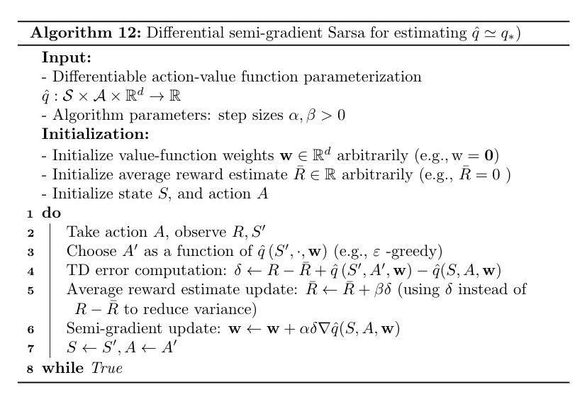

# Control with Function Approximation

## Action-dependent features

To approximate action-values we can stack features representations for the different states, e.g.

$f(s, a) = (0 , 0, 0, \dots, \delta_a^{a_i} f(s, a_i)^T, 0, 0, 0\dots)$

we can also use a single model to output the values of all of the actions $\hat q (s, a, w)  = \text{estimator}_a(f(s), w)$ to achieve generalization accross actions.

## Temporal difference with function approx. and semi-gradient

Sarsa is the same as tabular Sarsa, but the tabular updates $Q(S_{t}, A_t) \leftarrow Q(S_t, A_t) + \alpha \left( R_{t+1} + \gamma Q(S_{t+1}, A_{t+1})- Q(S_t, A_t)\right)$ is replaced by $w \leftarrow w + \alpha \left[ R_{t+1} +\gamma \hat q(S_{t+1}, A_{t+1}, w)- \hat q (S_t, A_t, w)\right]\nabla_w \hat q$.

Expected gradient: $\mathbf{w} \leftarrow \mathbf{w}+\alpha\left(R_{t+1}+\gamma \color{red}{\sum_{a^{\prime}} \pi\left(a^{\prime} | S_{t+1}\right) \hat{q}\left(S_{t+1}, a^{\prime}, \mathbf{w}\right)}-\hat{q}\left(S_{t}, A_{t}, \mathbf{w}\right)\right) \nabla \hat{q}\left(S_{t}, A_{t}, \mathbf{w}\right)$

Q-learning: $\mathbf{w} \leftarrow \mathbf{w}+\alpha\left(R_{t+1}+\gamma \color{red}{\max_{a'} \hat{q}\left(S_{t+1}, a^{\prime}, \mathbf{w}\right)}-\hat{q}\left(S_{t}, A_{t}, \mathbf{w}\right)\right) \nabla \hat{q}\left(S_{t}, A_{t}, \mathbf{w}\right)$

## Average reward

Reward discount can be problematic for problems where the reward is delayed. 

To avoid the discount problem in continuing tasks, we introduce the **Average Reward** $r(\pi)=\sum_{s} \mu_{\pi}(s) \sum_{a} \pi(a | s) \sum_{s^{\prime}, r} p\left(s^{\prime}, r | s, a\right) r$ and use it to define the **Differential Return**: $G_{t}=\left[R_{t+1}-r(\pi)\right]+\left[R_{t+2}-r(\pi)\right]+\left[R_{t+3}-r(\pi)\right]+\ldots$

Corresponding Bellman equations: $q_{\pi}(s, a)=\sum_{s, r} p\left(s^{\prime}, r | s, a\right)\left(r-r(\pi)+\sum_{a^{\prime}} \pi\left(a^{\prime} | s^{\prime}\right) q_{\pi}\left(s^{\prime}, a^{\prime}\right)\right)$

