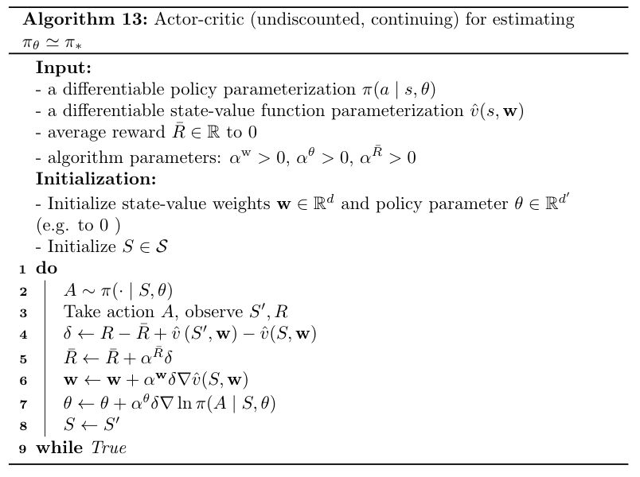
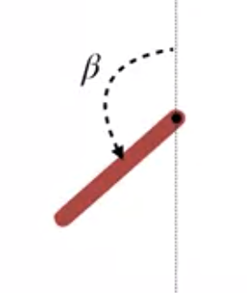
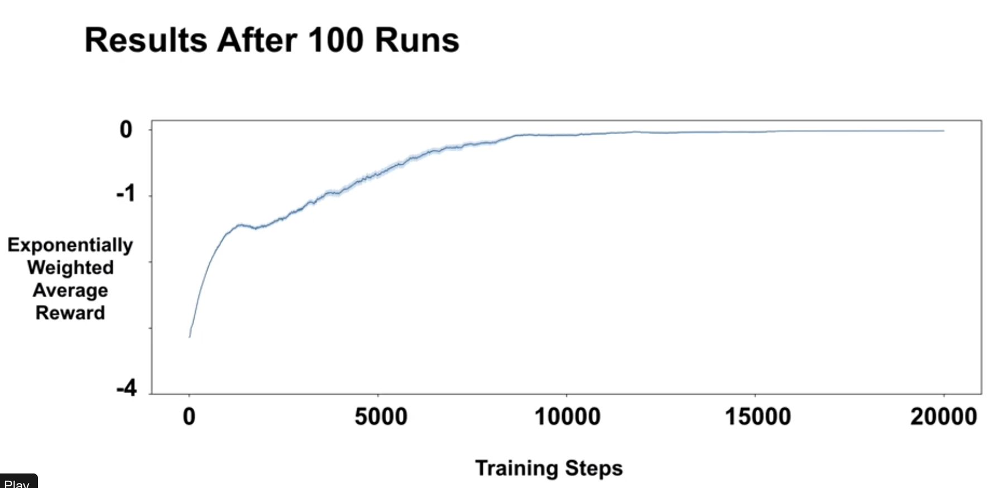
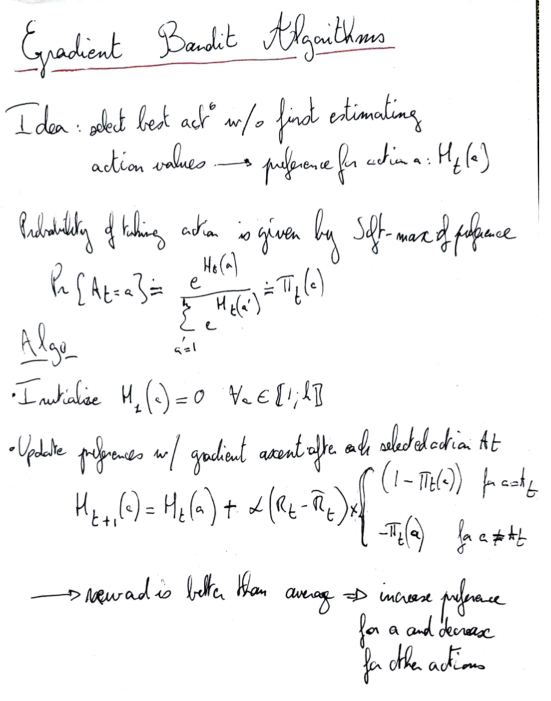
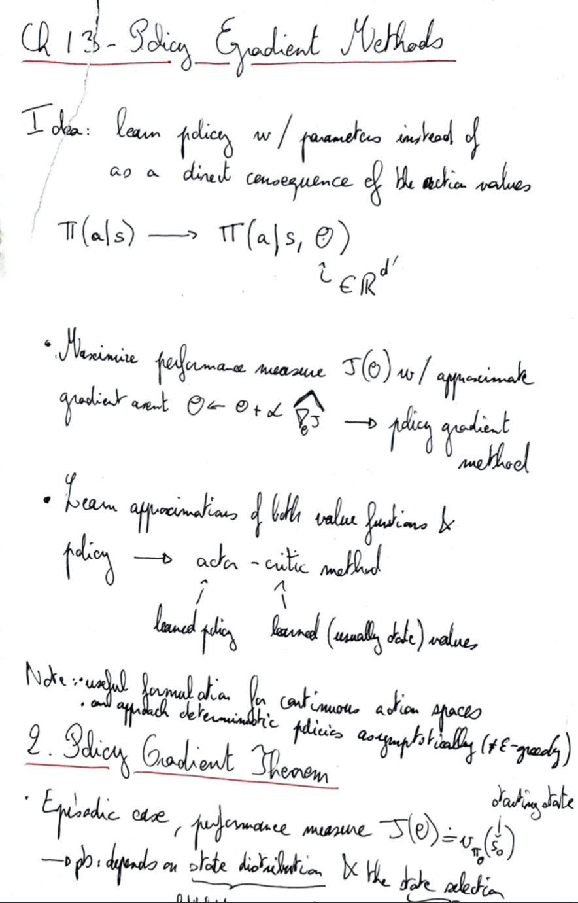
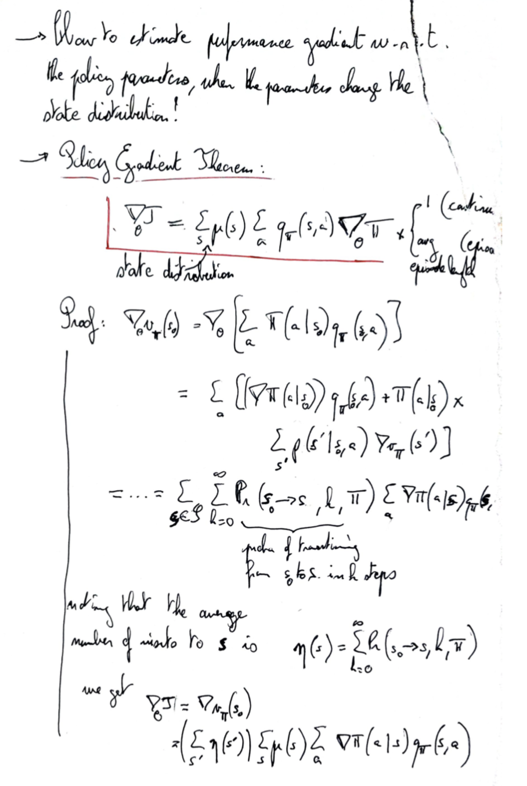
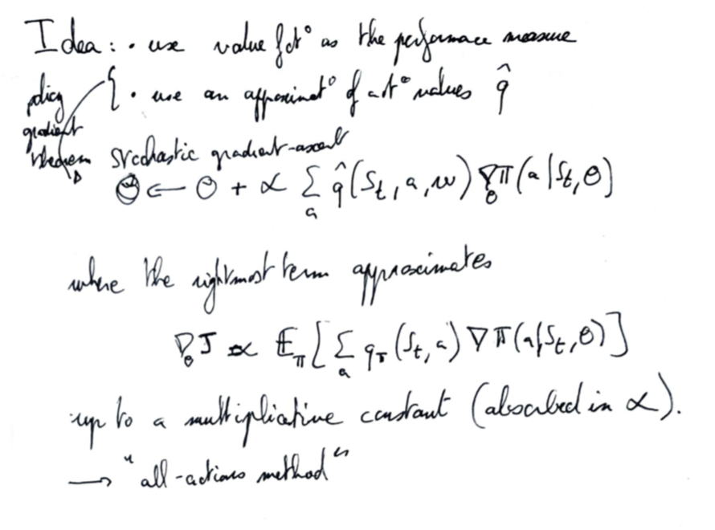
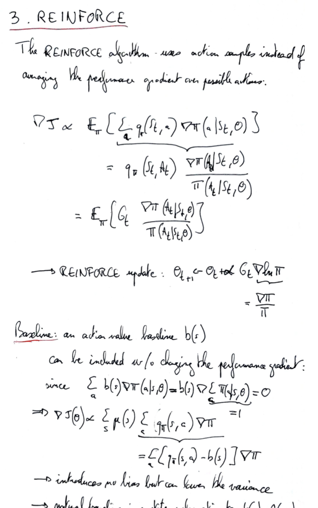
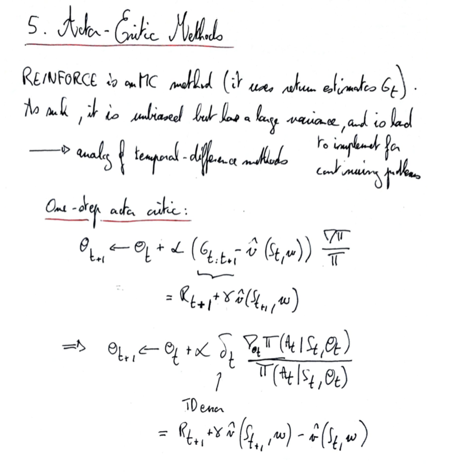

# Policy Gradients Methods

## Direct policy optimization

So far we've deduced the policy from the action values. The idea of policy gradient methods is to learn those policies directly.

Proba of taking action $a$ in state $s$ is parametrized by a vector $theta$: $\pi(a|s) \rightarrow \pi(a|s, \theta)$

$\pi(a|s,\theta)$ has to satisfy the constraints of a probability distribution: 

- Positive: $\pi(a|s,\theta) \ge 0 \quad \forall a, s$
- Normalized: $\sum_a \pi(a|s,\theta) = 1 \quad \forall s$ 

Because of those constraints we cannot use a linear approximation for the policy, but we can use, for instance, a softmax of the **action preference** $h(s,a,\theta)$: 

$\pi(a|s,\theta)=\frac{\exp(h(s,a,\theta))}{\sum_{a'}\exp(h(s,a,\theta))}$ 

Note: we don't use the action values for preferences since the action values maybe be very close for different actions, while we want to be able to approach a deterministic policy with a strong preference for a single action (or a subet of actions).

Advantages of stochastic policies over policies deduced from action values (like $\epsilon$-greedy):

- Can explore more at the beginning (similar action preferences), and converge toward quasi-deterministic greedy policies (one action preference much larger than the others) → decrease exploration over time
- Can approximate stochastic optimal policies (e.g. if the optimal policy is to go left or right with 50% probability)
- Sometimes the optimal policy is simpler that the value function

## Policy Gradient Theorem

Goal (continuing undiscounted case): find a policy that maximizes the average reward $r(\pi)=\mathbb E [R_t] = \sum_{s} \mu(s) \sum_{a} \pi(a \mid s, \boldsymbol{\theta}) \sum_{s', r} p\left(s^{\prime}, r \mid s, a\right) r$ 

The challenge in optimizing this goal comes from the fact that the states visitation frequency $\mu$ depends on the parameters $\theta$ that we want to optimize, through the gradient of the visitation frequency:

$\begin{aligned} \nabla r(\pi)=& \nabla \sum_{s} \mu(s) \sum_{a} \pi(a \mid s, \boldsymbol{\theta}) \sum_{s^{\prime}, r} p\left(s^{\prime}, r \mid s, a\right) r \\=& \sum_{s}[\nabla \mu(s)] \sum_{a} \pi(a \mid s, \boldsymbol{\theta}) \sum_{s^{\prime}, r} p\left(s^{\prime}, r \mid s, a\right) r \\ &+\sum_{s} \mu(s) \nabla \sum_{a} \pi(a \mid s, \boldsymbol{\theta}) \sum_{s^{\prime}, r} p\left(s^{\prime}, r \mid s, a\right) r \end{aligned}$ ​

Solution: Policy gradient theorem (proof in the book, section 13.6): 

$\nabla r(\pi)=\sum_{s} \mu(s) \sum_{a} \nabla \pi(a \mid s, \boldsymbol{\theta}) q_{\pi}(s, a)$

Interpretation of the r.h.s.:

- the $\nabla \pi$ term describe by how much $\theta$ should be changed to increase the probability of action $a$ in state $s$  (thereby decreasing the probabilities of other actions)
- This $\nabla \pi$ term is weighted by the corresponding action value $q_\pi$
- The sum over the actions gives an overall optimal direction for the policy gradient

## Policy gradient estimation

Goal: estimate gradient of the average reward with stochastic samples. 

Let's rewrite the policy gradient theorem: $\nabla r(\pi)=\mathbb E _\mu \Big[ \sum_{a} \nabla \pi(a \mid s, \boldsymbol{\theta}) q_{\pi}(s, a)\Big] $

To get an estimate of the term between brackets, we can sample actions because they are distributed according to the policy $\pi$:  

$ \sum_{a} \nabla \pi(a \mid s, \boldsymbol{\theta}) q_{\pi}(s, a) =\sum_{a} \pi(a, s, \boldsymbol{\theta}) \frac{\nabla \pi(a \mid s, \boldsymbol{\theta})}{\pi(a | s, \boldsymbol{\theta}) } q_{\pi}(s, a) = \mathbb E _\pi \Big[ \frac{\nabla \pi(A \mid s, \boldsymbol{\theta})}{\pi(A | s, \boldsymbol{\theta}) } q_{\pi}(s, A)\big]= \mathbb E _\pi \Big[ \nabla \ln \pi(A | s, \boldsymbol{\theta}) \; q_{\pi}(s, A)\big]$

where $A$ is drawn from the policy $\pi$.

The policy gradient update then reads: $\boldsymbol{\theta}_{t+1} \doteq \boldsymbol{\theta}_{t}+\alpha \nabla \ln \pi\left(A_{t} \mid S_{t}, \boldsymbol{\theta}_{t}\right) q_{\pi}\left(S_{t}, A_{t}\right)$

Note: The action value $q_\pi$ has to be estimated separately (e.g. with Average Reward Semi-gradient TD(0)).

## Actor-critic methods

Idea: combine action values estimation (the "critic", since it estimates the quality of a policy) and policy optimization (the "actor", that acts on the policy to improve it).

A straightforward possibility for the action value estimation is to use the TD(0) update with any value function evaluation method: $ q_{\pi}\left(S_{t}, A_{t}\right) = (R_t - \overline R + \hat v (S_{t+1}, w))$.

We can reduce the variance (without introducing bias) with the introduction of a **baseline** $\hat v (s_t, w)$ that does not depend on the action: 

$(R_t - \overline R + \hat v (S_{t+1}, w)) \rightarrow (R_t - \overline R + \hat v (S_{t+1}, w) \color{red}{-\hat v (S_t, w)}) =\delta_t$ 

where $\delta_t$ is the TD error. 

The additional term $\hat v(S_t, w)$ does not change the expectation of the policy gradient update since $\mathbb E _\pi \Big[ \nabla \ln \pi (a|S_t, \boldsymbol{\theta}_t)\hat v(S_t, w)\Big]=\sum_a \pi(a|S_t,\boldsymbol{\theta}_t) \nabla \ln \pi (a|S_t, \boldsymbol{\theta}_t)\hat v(S_t, w) = \hat v(S_t, w) \nabla \sum_a  \pi (a|S_t, \boldsymbol{\theta}_t) = \hat v(S_t, w) \nabla 1 = 0 $ 

→ Actor-critic gradient ascent:

$\boldsymbol{\theta}_{t+1} \doteq \boldsymbol{\theta}_{t}+\alpha \nabla \ln \pi\left(A_{t} \mid S_{t}, \boldsymbol{\theta}_{t}\right) \delta_{t}$

Interpretation: if the critic estimates that the action taken was positive (positive TD error $\delta_t$), then the gradient term will change the values of $\theta$ as to increase the probability of the selected action.

### Actor-critic with softmax policy and linear action preferences

In this example we use the same features $x$ for value estimates and the policy (with stacked states features for the policy features $x_h$):

$\hat v (s, w) = w^\intercal x(s)$ and $h(s, a, \theta) = \theta^{\,\intercal} 	x_h(s, a) $, with $\pi(a|s, \theta) = \frac{\exp\left(h(s,a,\theta)\right)}{\sum_{a'}\exp(h(s,a,\theta))}$

Update equations:

- Critic (standard semi-gradient TD(0)): $\mathbf{w} \leftarrow \mathbf{w}+\alpha^{\mathbf{w}} \delta \nabla \hat{v}(S, \mathbf{w})= \mathbf{w}+\alpha^{\mathbf{w}} \delta \;x(s)$
- Actor: $\boldsymbol{\theta} \leftarrow \boldsymbol{\theta}+\alpha^{\boldsymbol{\theta}} \delta \nabla \ln \pi(A \mid S, \boldsymbol{\theta})=\dots=\boldsymbol{\theta}+\alpha^{\boldsymbol{\theta}} \delta \; \left[\mathbf{x}_{h}(s, a)-\sum_{a'} \pi(a' \mid s, \boldsymbol{\theta}) \mathbf{x}_{h}(s, a')\right]$

## Example: pendulum swing up problem

Goal: keep a pendulum up by applying angular acceleration. 

- State: $(\beta, \;\dot\beta)$, the angular position and velocities

- Actions: $a \in \{-1, 0, +1\}$, the angular acceleration

- Reward: minus the angular distance from vertical

Note: If the angular velocity exceeds $2\pi$ in abolute value the system resets the position and velocity to 0.

Parametrization and features: linear preference and state values, tile-coding for features with a single tiling and 32 tiles in the two-dimensional position/velocities space: $[-\pi, \pi)\times(-2\pi, 2\pi)$. 

We choose a larger learning rate for the critic, and the agent converges efficiently

## Gaussian Policies for Continuous Actions

Problems with discrete actions:

- Might not be obvious how to choose a discrete set of actions
- We have to treat all actions independently, although some actions might be very similar to others (e.g. increase speed by 5 miles/hour and increase speed by 6 miles per hour)

Solution: continuous actions. For a given state, the action is sampled from a probability distribution.

Example of Gaussian policies: $\pi(a \mid s, \boldsymbol{\theta}) \doteq \frac{1}{\sigma(s, \boldsymbol{\theta}) \sqrt{2 \pi}} \exp \left(-\frac{(a-\mu(s, \boldsymbol{\theta}))^{2}}{2 \sigma(s, \boldsymbol{\theta})^{2}}\right)$

where $\mu(s, \boldsymbol{\theta}) \doteq \boldsymbol{\theta}_{\mu}^{T} \mathbf{x}(s)$, $\sigma(s, \boldsymbol{\theta}) \doteq \exp \left(\boldsymbol{\theta}_{\sigma}^{T} \mathbf{x}(s)\right)$ → the learned parameters are the vector $(\boldsymbol{\theta}_{\mu}^{T}, \boldsymbol{\theta}_{\sigma}^{T})^\top$. 

Note: The agent can reduce exploration over time by learning a narrower standard deviation $\sigma$.

## Written notes

