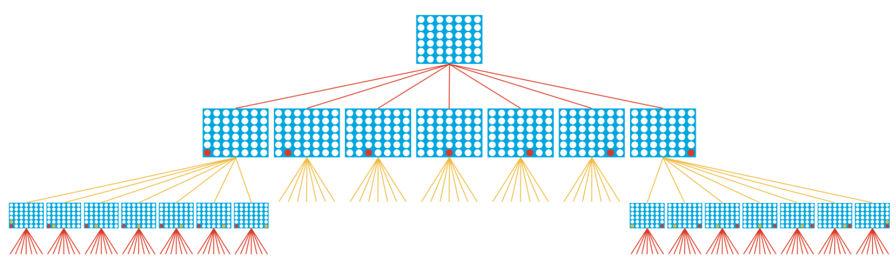
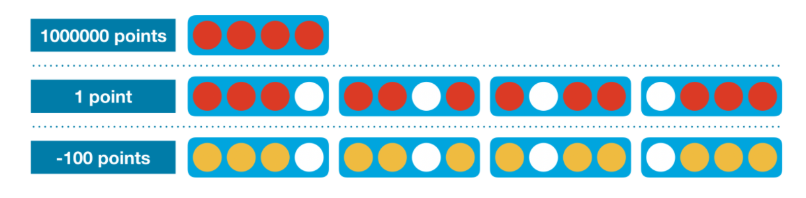
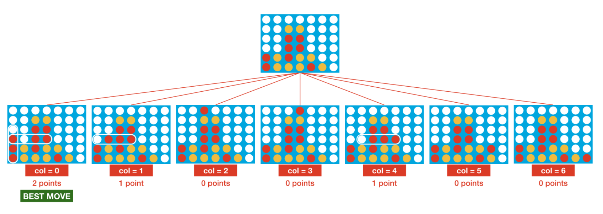
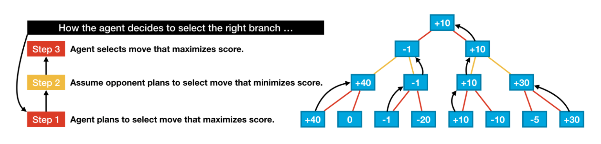
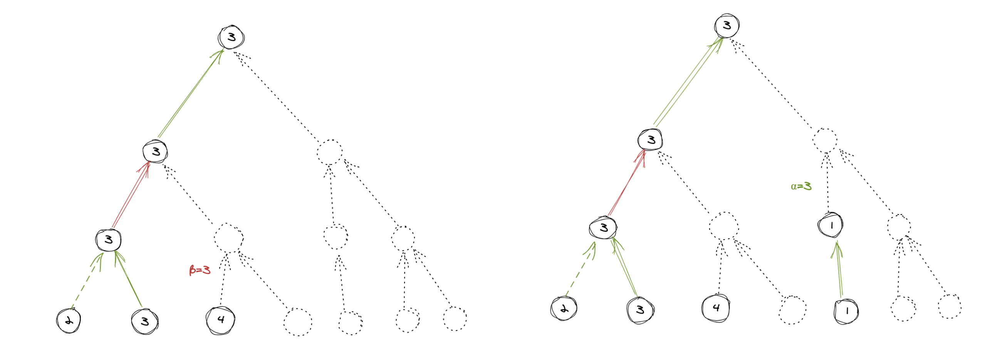

# Kaggle RL tutorial

https://www.kaggle.com/alexisbcook/play-the-game

## Connect 4 

### One-step lookahead

### Minimax

Optimization technique: [Alpha-Beta pruning](https://en.wikipedia.org/wiki/Alpha–beta_pruning)

$\alpha$:  minimum score that the maximizing player is assured of

$\beta$:  maximum score that the minimizing player is assured of

Example of when search can stop based on the values of $\alpha$ and $\beta$

